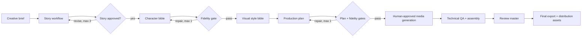
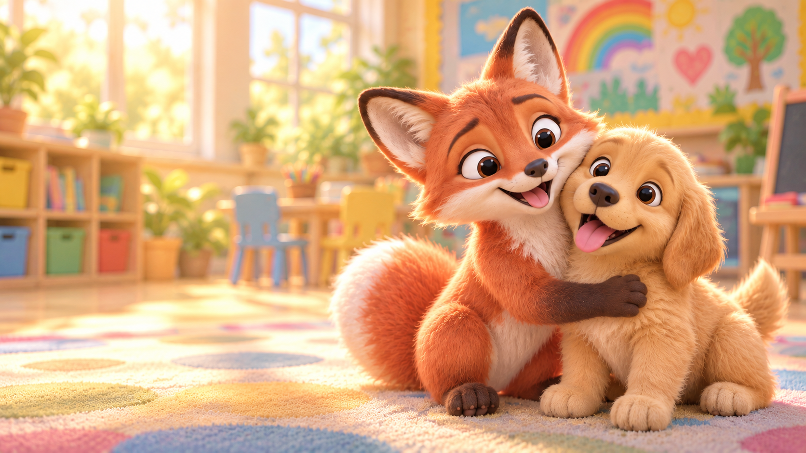

# AI Kids Story Studio — Architecture Case Study

> A portfolio case study for an AI-assisted animated-story production pipeline.
> This repository contains documentation and one selected pilot still. Production
> source, creative prompts, the full story world and character library, generated
> media collection, and provider configuration remain private.

## What this project demonstrates

AI Kids Story Studio turns a short creative brief into a validated production plan
for a children’s animated story. Its design separates creative generation from
deterministic validation, and keeps human creative approval at the points where it
matters most.

- **Orchestration:** Python, LangGraph and LangChain
- **Structured contracts:** Pydantic models and JSON artifacts
- **Local LLM runtime:** Ollama, with specialised generator, judge and fidelity-review roles
- **Quality system:** structural validation, semantic fidelity gates and bounded repair loops
- **Media workflow:** OpenAI ImageGen keyframes, Wan 2.2 image-to-video, ElevenLabs narration, technical QA, deterministic assembly and delivery manifests

## Pipeline at a glance

See [the architecture](docs/ARCHITECTURE.md) for the component breakdown.

## Selected pilot still

*A single still from the private pilot, shared solely to illustrate the visual
outcome. All rights reserved; it is not licensed for reuse.*

## Pilot media stack

The pilot combined a controlled agent workflow with human-operated media tools.
Provider credentials, prompts and production automation remain private; the
providers and their roles are documented here for technical transparency.

| Stage | Technology used in the pilot | Role |
| --- | --- | --- |
| Keyframes and thumbnail artwork | OpenAI ImageGen in ChatGPT | Generated approved still frames and source artwork under human creative review. |
| Animation | Wan 2.2 14B Fast, via a Hugging Face ZeroGPU Space | Turned approved keyframes into individual image-to-video clips. |
| Narration | ElevenLabs `eleven_multilingual_v2` | Produced the English narration, which was then normalized and QA-checked locally. |
| Music | YouTube Audio Library | Provided the licensed music track used in the final mix. |
| Assembly and QA | Python and FFmpeg-based scripts | Validated, assembled and packaged the final media. |

Media creation was intentionally human-controlled: the pipeline prepared the
next approved input and validated the returned artifact, rather than performing
unattended bulk generation.

## Models used in the pilot

| Responsibility | Model |
| --- | --- |
| Story planning, writing, character bible, visual style bible and production planning | Ollama `qwen3:8b` |
| Independent story judgment | Ollama `gpt-oss:20b` |
| Semantic fidelity reviews | Ollama `qwen2.5:14b-instruct` |
| Keyframe and thumbnail-art generation | OpenAI ImageGen in ChatGPT |
| Image-to-video animation | Wan 2.2 14B Fast |
| English narration | ElevenLabs `eleven_multilingual_v2` |

## Pilot outcome

The pilot validated the full workflow from brief to a publication-ready animation:

| Deliverable | Result |
| --- | --- |
| Story structure | 4 scenes, 20 planned shots |
| Visual production | 20 keyframes and 20 video clips |
| Final master | 110.25 seconds, H.264 video and stereo AAC |
| Validation | media decode, narration/audio QA, artifact completeness and delivery manifest |
| Distribution | long-form metadata, safe-area thumbnail and three vertical short-form assets |

## Design principles

1. **LLMs create; code verifies.** Creative choices are generated by models, while IDs,
   time budgets, schemas, invariants and quality thresholds are deterministic.
2. **Quality gates do not silently weaken.** A failing semantic or structural check
   stops the run or invokes one bounded repair attempt with explicit findings.
3. **Each approved run is reproducible.** Immutable JSON snapshots preserve the story,
   bibles, reviews and production plan.
4. **Human review remains intentional.** External image/video generation and final
   artistic approval are not automated away.

## Repository status

This is a read-only portfolio case study, not an installable story generator.
For collaboration, technical discussion, or a private walkthrough, please contact
the repository owner.
