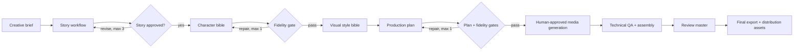

# AI Kids Story Studio — Architecture Case Study

> A portfolio case study for an AI-assisted animated-story production pipeline.
> This repository intentionally contains documentation only. The production source,
> creative prompts, story worlds, characters, generated media, and provider setup
> remain private.

## What this project demonstrates

AI Kids Story Studio turns a short creative brief into a validated production plan
for a children’s animated story. Its design separates creative generation from
deterministic validation, and keeps human creative approval at the points where it
matters most.

- **Orchestration:** Python, LangGraph and LangChain
- **Structured contracts:** Pydantic models and JSON artifacts
- **Local LLM runtime:** Ollama, with specialised generator, judge and fidelity-review roles
- **Quality system:** structural validation, semantic fidelity gates and bounded repair loops
- **Media workflow:** image/video/narration handoff, technical QA, deterministic assembly and delivery manifests

## Pipeline at a glance

See [the architecture](docs/ARCHITECTURE.md) for the component breakdown.

## Pilot outcome

The pilot validated the full workflow from brief to a publication-ready animation:

| Deliverable | Result |
| --- | --- |
| Story structure | 4 scenes, 20 planned shots |
| Visual production | 20 keyframes and 20 video clips |
| Final master | 110.25 seconds, H.264 video and stereo AAC |
| Validation | media decode, audio QA, artifact completeness and delivery manifest |
| Distribution | long-form metadata, safe-area thumbnail and three vertical short-form assets |

## Design principles

1. **LLMs create; code verifies.** Creative choices are generated by models, while IDs,
   time budgets, schemas, invariants and quality thresholds are deterministic.
2. **Quality gates do not silently weaken.** A failing semantic or structural check
   stops the run or invokes one bounded repair attempt with explicit findings.
3. **Each approved run is reproducible.** Immutable JSON snapshots preserve the story,
   bibles, reviews and production plan.
4. **Human review remains intentional.** External image/video generation and final
   artistic approval are not automated away.

## Repository status

This is a read-only portfolio case study, not an installable story generator.
For collaboration, technical discussion, or a private walkthrough, please contact
the repository owner.
