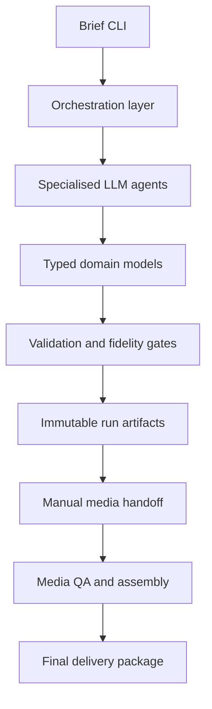

# Architecture

## System boundary

The pipeline is split into five layers. The public case study describes their
responsibilities without exposing reusable creative prompts, proprietary story
concepts, provider credentials or production source code.



## 1. Orchestration layer

Python coordinates the run lifecycle. LangGraph manages the story review/rewrite
loop and carries approval state explicitly rather than treating model prose as a
decision. A run identifier ties every artifact and QA result to one production run.

**Responsibilities**

- accepts a brief, target age and duration;
- executes each stage in a controlled order;
- enforces bounded retries;
- records timestamps and durable run metadata.

## 2. Creative-agent layer

Specialised roles use local Ollama models rather than one generic prompt:

| Role | Responsibility |
| --- | --- |
| Planner and writer | Produce a story plan and child-appropriate narrative. |
| Reviewer and independent judge | Assess story quality independently. |
| Character-bible creator | Defines stable visual identity and constraints. |
| Style-bible creator | Defines palette, lighting, camera language and exclusions. |
| Production planner | Converts scenes into timed shots. |
| Fidelity reviewers | Compare generated plans against approved source artifacts. |
| Repair agents | Make one targeted correction from recorded findings. |

Models are selected by task: a generation model for planning/writing, a separate
judge model for independent evaluation, and an instruction model for semantic
fidelity checks. Model identifiers and prompt templates are private configuration.

## 3. Typed contracts and deterministic validation

Pydantic contracts model stories, characters, visual bibles, production plans and
reviews. Deterministic services validate facts that should never be delegated to a
language model: required fields, scene/shot identifiers, timing budgets, character
roster completeness and artifact shape.

Examples of invariants:

- all recurring named characters have a precise species and profile;
- a production plan has the required scene and shot structure;
- shot duration totals match the requested duration budget;
- character identity changes are treated as blocking fidelity failures;
- a repaired artifact is validated again before it can proceed.

## 4. Media handoff and QA

The system exports a single next prompt and expected file location for a human
operator. This supports external image-to-video tools while preserving continuity
and avoiding uncontrolled bulk generation.

After each handoff, scripts check file existence, dimensions, duration, codec,
decodeability, audio properties and completeness. The assembly stage creates scene
masters, a review master and a final delivery manifest.

## 5. Artifact lifecycle

Each successful stage saves a latest artifact for convenient access and an immutable
snapshot under a run-specific archive. Fidelity reviews are retained even when a
gate fails, allowing review criteria to improve from real evidence.

```text
run/<run_id>/
├── story.json
├── character_bible.json
├── character_bible_fidelity_review.json
├── visual_style_bible.json
├── production_plan.json
├── production_fidelity_review.json
└── run.json
```

## Technology choices

| Area | Technology |
| --- | --- |
| Language/runtime | Python |
| Workflow orchestration | LangGraph |
| LLM integration | LangChain + Ollama |
| Data contracts | Pydantic |
| Media processing and QA | deterministic Python/FFmpeg-based scripts |
| Data format | JSON run artifacts |
| Development environment | Windows, virtual environment, local models |

## Trade-offs

- The system prioritises validation and repeatability over one-click generation.
- External visual generation stays manual because creative quality and provider
  access require human judgement.
- The project uses local models for predictable cost and privacy, while retaining
  provider adapters as an extensibility boundary.
